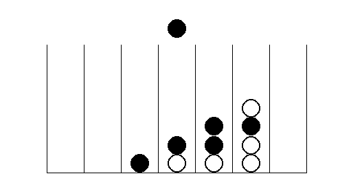

# Four in a Row Game in Jack Programming Language

Welcome to the Four in a Row game implemented in the Jack programming language! This game is developed as part of the Nand to Tetris course's Hack computer project, where we aim to build a complete computer system from the ground up.

## Table of Contents

- [Introduction](#introduction)
- [Getting Started](#getting-started)
- [Game Rules](#game-rules)
- [Controls](#controls)
- [Implementation Details](#implementation-details)
- [Acknowledgments](#acknowledgments)

## Introduction

This repository contains the implementation of the classic game Four in a Row, also known as Connect Four, using the Jack programming language. The goal of the game is to be the first player to connect four of their own discs of the same color in a row, either horizontally, vertically, or diagonally.

## Getting Started

To play the Four in a Row game on the Hack computer, follow these steps:

1. Download or clone this repository to your Hack computer.
2. Load the Jack files into your Jack compiler or assembler.
3. Compile and run the program on your Hack computer's simulated hardware.

## Game Rules

The game is played on a 7x6 grid, where players take turns dropping their colored discs into one of the seven columns. The disc falls to the lowest available position in the chosen column. The first player to connect four of their discs in a row wins the game.

## Controls

- Use the arrow keys to move the cursor left and right.
- Press the "Enter" key to drop your disc into the selected column.
- To exit the game, press the "Esc" key.

## Implementation Details

Here's an overview of the main components of the Four in a Row game implementation:

- **Board:** The game board is represented as a 2D array, with each cell containing information about the color of the disc placed there.

- **Player Turns:** The game keeps track of which player's turn it is and alternates between them after each move.

- **Winning Check:** After each player's move, the program checks for a winning combination of discs to determine if the game has been won.

- **User Interface:** The game provides a simple text-based user interface, allowing players to interact with the game using arrow keys and the "Enter" key.

- **Input Handling:** The program reads input from the keyboard and responds accordingly, allowing players to drop discs into the desired columns.

- **End of Game:** Once a player wins or the game ends in a draw, the program displays the result and provides an option to start a new game or exit.

## Acknowledgments

This Four in a Row game was developed as an educational project for the Nand to Tetris course. Special thanks to the course instructors and creators for providing the Hack computer platform and the Jack programming language for our learning and exploration.

Enjoy the game, and may the best player win!
